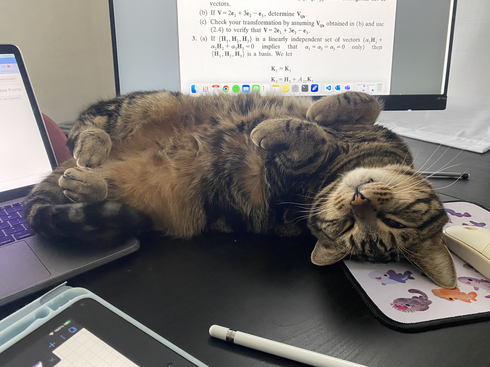

# HW 1 - CS 625, Fall 2023

Jenah Parman\
Due: September 6, 2023

## Git, GitHub

*What is the URL of the GitHub repo that you created in your personal account?*\
https://github.com/jenahparman/CS625
   
*In which direction does the 'pull' command work (send local changes to remote OR send remote changes to local)?*\
'Pull' sends remote changes to local.
   
*If you have committed a change on your local machine, but do not see the update on GitHub.com, what step might have you forgotten?*\
Pushing changes to GitHub.com may have been forgotten.

## Markdown

*Create a bulleted list with at least 3 items*
- Pineapple
- Mango
- Kiwi

*Write a single paragraph that demonstrates the use of italics, bold, bold italics, code, and includes a link. The paragraph does not have to make sense.*\
The girl was reading a book called ***The Self-Taught Programmer:*** *The Definitive Guide to Programming Professionally*. She took a break from reading to write her **first** program: `print("Hello, World!")`. After successfully running the program, she shared her excitement on [her blog](https://www.google.com/).

*Create a level 3 heading*
### Level 3 Heading

*Insert an image of an animal, sized appropriately*\

## Tableau

*Insert your the image of your final bar chart here. Reminder, this should show data from a region other than the South.*\

## Google Colab

*What is the URL of your Google Colab notebook?*\
https://colab.research.google.com/drive/1InpesLqQwBsSt9UBTslAY9jZLqWDbmX8?usp=sharing

## Python/Seaborn

*Insert the first penguin chart here*\

*Describe what the figure is showing.*\
This figure shows penguins' bill depth and bill length. It helps visualize the correlation of bill depth and length among sampled penguins.

*Insert the second penguin chart here*\

*Describe what the figure is showing.*\
This figure shows the mean body mass of each penguin species sampled.

*What happened when you removed the outer parentheses from the code? Why?*\
There is a syntax error when the outer parenthesis are removed. This is because the function call is wrapped over multiple lines, and the outer parenthesis are neccessary for this to be understood.

## Observable and Vega-Lite

*What happens when you replace `markCircle()` with `markSquare()`?*\
markSquare() causes the circles in the chart to become squares.

*What happens when you replace `markCircle()` with `markPoint()`?*\
markPoint() causes the circles in the chart to become hollow circles.

*What change do you need to make to swap the x and y axes on the scatterplot?*\
Change `vl.x().fieldQ("Horsepower")` to `vl.y().fieldQ("Horsepower")`\
and `vl.y().fieldQ("Miles_per_Gallon")` to `vl.x().fieldQ("Miles_per_Gallon")`.

*Insert the bar chart image here*\

*Why do you think this chart is the result of this code change?*\
Removing the line, `vl.y().fieldN("Origin"),`, took away the y-values which were originally three countries of origin. The purpose of the chart was to show quantity of cars from each country. Without the y-values, it just shows the total for all countries.

## References

*Every report must list the references (including the URL) that you consulted while completing the assignment. Replace the items below with the references you consulted*

* Markdown Guide, <https://www.markdownguide.org/basic-syntax>
* Tutorial: Get Started with Tableau Desktop, <https://help.tableau.com/current/guides/get-started-tutorial/en-us/get-started-tutorial-home.htm>
* Overview of Colaboratory Features, <https://colab.research.google.com/notebooks/basic_features_overview.ipynb>
* seaborn.objects.Agg, <https://seaborn.pydata.org/generated/seaborn.objects.Agg.html#seaborn.objects.Agg>
* Breaking up long lines of code in Python, <https://www.pythonmorsels.com/breaking-long-lines-code-python/>
* A taste of Observable, <https://observablehq.com/@observablehq/a-taste-of-observable>
* Charting with Vega-Lite / Observable, <https://observablehq.com/@observablehq/vega-lite>

