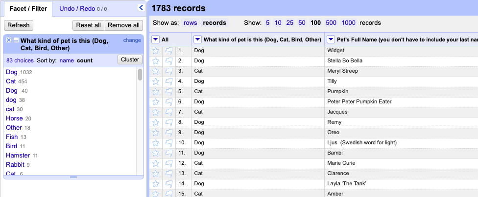
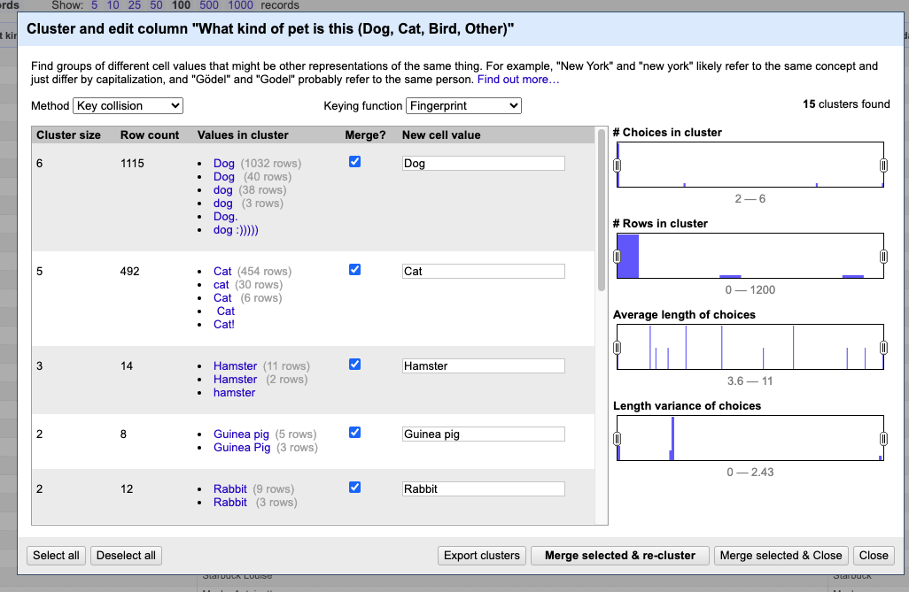
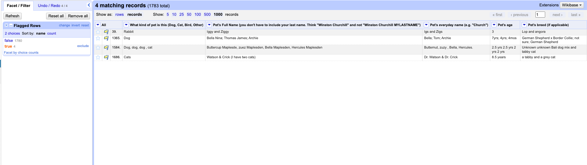

# HW 2: Data Cleaning - CS 625, Fall 2023

Jenah Parman\
Due: September 20, 2023

## Introduction

This report will guide you through the steps I took to clean the PetNames.tsv dataset for analysis. The survey was iniated on July 21, 2019 on Twitter by Dr. Jen Golbeck, and it collected information about people's pets, including the type of pet, the pet's full name (excluding the owner's last name), the pet's everyday name, age, and breed. Interestingly, the main goal of gathering this data was to create a messy dataset intentionally for practicing data cleaning. Now, let's dive into the steps I took to accomplish this goal.

## Data Cleaning Process

I began the data cleaning process by first reviewing the analysis questions. The first question pertained to the different kinds of pets, so this is where I decided to start cleaning.

I started by using *Text facet* on the pet type column to see all the unique values and their frequencies. I then used the *Cluster* feature to see join any pet kinds that represent the same information.

I was able to join several instances of misspellings or variations or  "Dog", "Cat", "Hamster", "Guinea Pig", etc.. I tried all of the different *Keying functions*, and was able to go from 83 unique values to 53 on the first round of clustering.

  

After inspecting the different unique values remaining, I noticed a row with multiple pets in one. I decided to find out if there were more of these instances and handle them before continuing.
I added a *Text filter* to the pet type column and searched for any entries that contained ",", ";" " and ", "&". I flagged the ones that seemed like they represented more than one pet. Then, I considered the possibility of respondents who have multiples on the same type of pet. I used a *Text filter* on the pet name column and followed the same search technique as before. I ended up finding four entries that represented more than one pet.

